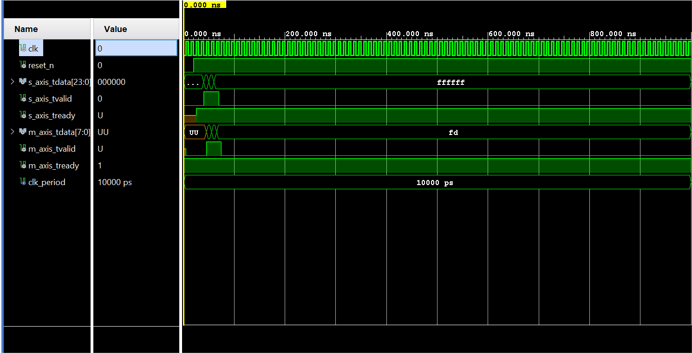

# Real-Time FPGA-Based Video Processing Engine (VHDL)

This repository contains a high-performance RTL pipeline designed for real-time video and image processing applications using VHDL. The architecture focuses on modularity and industry-standard interfaces.

Key Features
* **AXI4-Stream Integration:** Standardized high-throughput data interfaces for seamless SoC integration.
* **Real-time Spatial Filtering:** Optimized RTL modules for grayscale conversion and image processing.
* **Modular Design:** Independent IP cores for flexible video pipeline configuration.

Technical Specifications
* **HDL Language:** VHDL
* **Target Platforms:** Xilinx Zynq-7000 / Artix-7
* **Development Tools:** Vivado Design Suite

Repository Structure
* `/src`: VHDL source files (RTL modules).
* `/sim`: Testbench files for behavioral simulation.
* `/doc`: Project documentation and architecture diagrams.

## Functional Verification
The core logic has been verified through RTL simulation using a custom VHDL testbench in Vivado.

* **AXI4-Stream Compliance:** Verified seamless data flow control with `TVALID`/`TREADY` handshake.
* **Bit-Accurate Results:** Successfully validated RGB-to-Grayscale conversion logic.
* **Pipeline Latency:** Confirmed 1-clock cycle deterministic processing delay.

---
*Note: This project is part of my continuous study on FPGA-based hardware acceleration and digital system design.*
